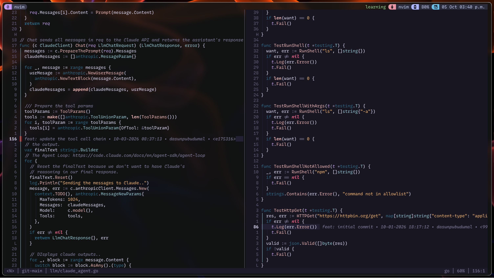

# tmux config

Personal tmux configuration with a [Catppuccin Mocha](https://github.com/catppuccin/tmux) theme and a transparent status bar.



## Plugins

Plugins are cloned manually into `~/.tmux/plugins/` (not managed by tpm) and loaded via `run` statements at the bottom of `tmux.conf`.

| Plugin | Purpose |
|--------|---------|
| [catppuccin/tmux](https://github.com/catppuccin/tmux) | Catppuccin Mocha theme |
| [tmux-battery](https://github.com/tmux-plugins/tmux-battery) | Battery status in the status bar |
| [tmux-smooth-scroll](https://github.com/noscript/tmux-smooth-scroll) | Smooth scrolling in copy mode |
| [vim-tmux-navigator](https://github.com/christoomey/vim-tmux-navigator) | Seamless pane navigation with Neovim |

## Key bindings

Prefix is `C-Space` (with `C-b` as a secondary).

### Panes

| Key | Action |
|-----|--------|
| `M-Enter` | Split vertically |
| `M-S-Enter` | Split horizontally |
| `M-Escape` | Kill pane |
| `prefix h` | Split vertically |
| `prefix v` | Split horizontally |
| `prefix x` | Kill pane |
| `C-M-h/j/k/l` | Focus pane left/down/up/right |
| `C-M-S-Arrow` | Resize pane |

### Windows

| Key | Action |
|-----|--------|
| `prefix c` | New window |
| `prefix k` | Kill window |
| `prefix r` | Rename window |
| `M-1` … `M-9` | Switch to window N |
| `M-Left/Right` | Previous/next window |
| `M-S-Left/Right` | Move window left/right |

### Sessions

| Key | Action |
|-----|--------|
| `prefix C` | New session |
| `prefix K` | Kill session |
| `prefix R` | Rename session |
| `M-Up/Down` | Previous/next session |

### Copy mode (vi)

| Key | Action |
|-----|--------|
| `v` | Begin selection |
| `y` | Copy selection |

### Misc

| Key | Action |
|-----|--------|
| `prefix q` | Reload config |
| `prefix ?` | Show keybindings |

## Installation

```sh
git clone <repo-url> ~/.tmux
```

Then clone each plugin listed above into `~/.tmux/plugins/` and start a new tmux session.
